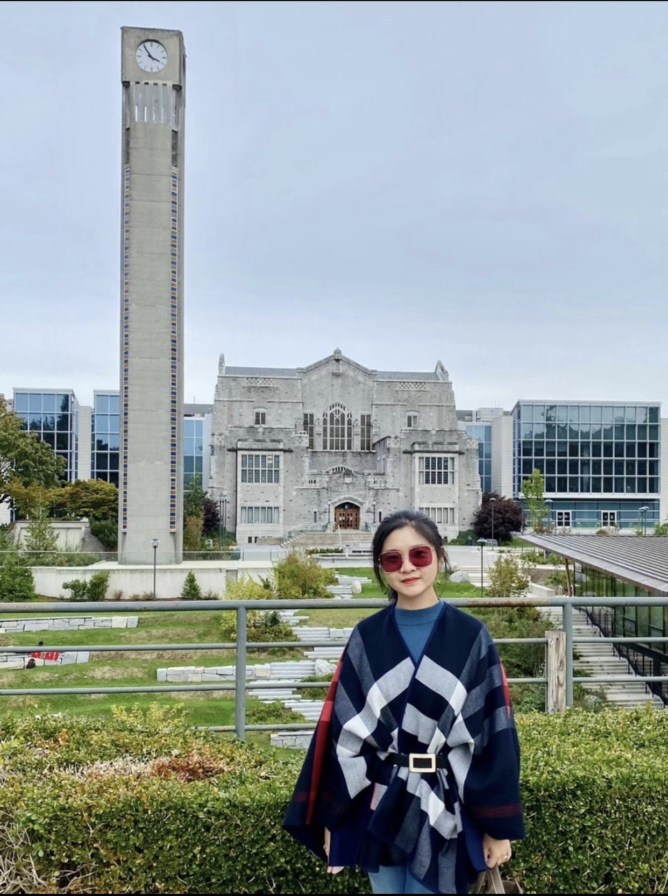

# Trainees (Present and Alumni)

- [X] **PhD Supervision**

| Name and website link | Research Interests or Bio | Image |
|--|----|-|
| [Christopher Andrew Basham](https://www.linkedin.com/in/candrewbasham/), [SPPH](http://www.spph.ubc.ca/), Graduation expected 2021 | C. Andrew Basham is a tuberculosis (TB) epidemiologist with a background in Environmental and Urban Studies (BA) from the University of Winnipeg. Andrew has worked with First Nations in remote communities as a health policy analyst for Manitoba Keewatinowi Okimakanak. In his MSc thesis in the University of Manitoba, Andrew investigated differences in TB program performance between First Nations (on and off-reserve), immigrants, and Canadian-born non-First Nations, discovering important population and geographic differences in program performance in the first application of quantitative performance measurement to a Canadian TB program. Andrew then worked for the Manitoba Centre for Health Policy, where he developed an interest in health administrative data linkage and analysis. Under the supervision of Drs. Ehsan Karim and James Johnston, Andrew has completed his doctoral research on TB survivor health using causal inference methods with health administrative data. Methods used included high-dimensional propensity scoring, with hybrid machine learning, directed acyclic graphs (DAGs), E-values for unmeasured confounding, and causal mediation analysis. Andrew has published extensively during his Ph.D. and is developing a new research interest in survivorship epidemiology. Andrew plans to develop a Partnership for Post-TB Health as a knowledge exchange and models of care development network. |  |
| [Md. Belal Hossain](https://www.linkedin.com/in/md-belal-hossain-3906b36a/), [SPPH](http://www.spph.ubc.ca/), transferred from MSc | Belal Hossain is a Ph.D. student at the School of Population and Public Health, University British Columbia. He is also working with Dr. Ehsan Karim as a Graduate Research Assistant at the School. Belal did his Bachelor’s and MSc degrees in Applied Statistics from the University of Dhaka. A recurring theme in his research is analyzing complex survey data collected through stratification and cluster sampling. He is motivated to develop and apply his skills within the public health realm through working experiences with various healthcare institutes in Bangladesh. Under Dr. Karim’s guidance, Belal has been working with causal inference methods to estimate treatment effects in trials with incomplete medication adherence, integrating machine learning approaches within the framework of causal inference, and applying/adapting these innovative and emerging techniques in real-life epidemiological data analysis. His current research interests include biostatistics and epidemiology, focusing on causal inference from observational studies and clinical trials with medication nonadherence, and machine learning and deep learning approaches in risk score prediction from a large healthcare database. |  |
| Fardowsa Yusuf, [SPPH](http://www.spph.ubc.ca/) | Multiple sclerosis, data mining, clustering; jointly supervised with Helen Tremlett. |  |
| [Zishan (Michelle) Cui](http://linkedin.com/in/zishan-michelle-cui-97a3882b), [SPPH](http://www.spph.ubc.ca/) | Zishan (Michelle) Cui has a background in Statistics. Zishan completed her MSc in statistics at the University of British Columbia. Zishan has been working as a biostatistician in Providence Health Care, and has engaged in marginalized population research. Particularly, Zishan is interested in using machine learning methods to tackle substance use problems in British Columbia. Under the supervision of Dr. Ehsan Karim and Dr. Thomas Kerr, Zishan is working on her Ph.D. in the School of Population and Public Health in machine learning methods and poly-substance use research. Currently, Zishan is working at BC Centre on Substance Use and working collaboratively with BCCDC regarding BC Provincial Overdose Cohort. She is also involved in causal inference research using marginal structural modeling and mediation analysis. |  |

- [x] **MSc Supervision**

| Name and website link | Research Interests or Bio | Image |
|--|----|-|
| Eric Sanders, [Statistics](http://www.stat.ubc.ca/), Graduated 2019, [Thesis](https://dx.doi.org/10.14288/1.0380529) | After completing BSc in Statistics at Queen’s University and MSc in Statistics with a Biostatistics specialization at the University of British Columbia (MSc thesis jointly supervised by [Prof. Paul Gustafson](https://scholar.google.ca/citations?user=yxcvXB0AAAAJ) and Dr. Ehsan Karim), Eric Sanders began working at TD Bank in Toronto, where he now holds a position as a Senior Risk Analyst. Research projects he has been involved with over the years include RCT analysis in pragmatic clinical trial settings, artificial light at night exposure and its supposed link to cancer risks, and avian influenza rates and varieties in waterfowl populations. |  |
| [Lucy Mosquera](https://www.linkedin.com/in/lucy-k-mosquera/), [Statistics](http://www.stat.ubc.ca/), Graduated 2020, [Thesis](https://dx.doi.org/10.14288/1.0392954) | Lucy Mosquera has a background in biology and mathematics, having completed her BSc at Queen’s University in Kingston and her MSc in statistics at the University of British Columbia. She is motivated by problems at the intersection of healthcare and data science, specifically ways to make health research more efficient. Under the supervision of Dr. Ehsan Karim, Lucy’s MSc. thesis compared causal inference methods to recover the true effect of receiving a new treatment when trial participants do not adhere to the treatment protocol. She has provided data management support to clinical trials and observational studies at Kingston General Hospital in the past. Currently, she is focused on methods to make better use of existing data through synthetic data generation to enable widespread data sharing at the start-up Replica Analytics. |  |
| [Mohammad Abdullah Heel Kafi](https://scholar.google.ca/citations?user=zAkZwDMAAAAJ), [SPPH](http://www.spph.ubc.ca/), Graduated 2021, [Thesis](https://dx.doi.org/10.14288/1.0397224) | Effect modification in propensity score |  |
| [Hanna Frank](https://www.linkedin.com/in/hanna-f-940813b9/), [SPPH](http://www.spph.ubc.ca/) | Hanna Frank is an MSc student at the UBC School of Population and Public Health, where she is currently performing research under the supervision of Dr. Ehsan Karim. She gained a background in mathematics, statistics, and computer science through the completion of a BSc in mathematical sciences at the University of British Columbia. She has worked in the industry at the German chemical company BASF to analyze agricultural research data, and at the Vancouver start-up Thrive Health to analyze COVID-19 data for presentation in interactive statistics dashboards. Her research interests focus on the use of data science in health care, and she is currently working on a project looking at the use of machine learning in propensity score methods in epidemiology. |  |

- [x] **Undergraduate Supervision**

| Name | Research Interests and activities| Image |
|--|----|-|
| Jingyi Huang, [Statistics](http://www.stat.ubc.ca/), Graduated 2018 | Simulating complex cross-sectional and longitudinal data based on hypothesized causal diagrams; jointly supervised with [Hubert Wong](https://scholar.google.com/citations?user=ZkOv_mkAAAAJ). After finishing her undergraduate degree, she joined as a Biostatistics M.Sc. Student at Harvard T.H. Chan School of Public Health. |  |
| Yang Qu, [Statistics](http://www.stat.ubc.ca/) | Data wrangling (R, Python) |  |
| An Hoang, [Foresry](https://forestry.ubc.ca/) | Data wrangling (R, Python) |  |

- [x] **Co-supervising / Committee member** 

| Name | Research Interests | Primary Supervisor | Program | Department | Graduation Year |
|-|--|-|-|-|-|
| [Mohammad Atiquzzaman](https://scholar.google.com/citations?user=kLAOcR0AAAAJ) | Osteoarthritis, mediation analysis, plasmode simulation | [Aslam Anis](https://scholar.google.com/citations?user=ZiEy4d8AAAAJ) | PhD | [Pharmaceutical Sciences](https://pharmsci.ubc.ca/)  | 2019, [Thesis](https://dx.doi.org/10.14288/1.0387284) |
| [Steve Kanters](https://scholar.google.com/citations?user=Y52-vGUAAAAJ) | Network meta analysis, Bayesian analysis, IPD, HIV | [Nick Bansback](https://scholar.google.com/citations?user=HMs0olgAAAAJ) | PhD | [SPPH](http://www.spph.ubc.ca/) | 2019, [Thesis](https://dx.doi.org/10.14288/1.0383244) |
| [Molly Sweeney Magee](https://scholar.google.com/citations?user=4bXL3kcAAAAJ) | Colorectal Cancer and missing data | [Trevor Dummer](https://scholar.google.com/citations?user=6qXib9YAAAAJ) | PhD | [SPPH](http://www.spph.ubc.ca/) | 2021, [Thesis](https://dx.doi.org/10.14288/1.0396770) |
| Derek Ouyang | Stepped-wedge Trial, and power | [Hubert Wong](https://scholar.google.com/citations?user=ZkOv_mkAAAAJ) | PhD | [SPPH](http://www.spph.ubc.ca/) | 2021, [Thesis](https://dx.doi.org/10.14288/1.0396685) |
| Katherine McLeod | Prison health policy, time-dependent modelling | [Jane Buxton](https://scholar.google.com/citations?user=pPItoZAAAAAJ) | PhD | [SPPH](http://www.spph.ubc.ca/) | Graduated expected 2021 |
| [Dahn Jeong](https://scholar.google.com/citations?user=hCn2msMAAAAJ) | Hepatitis C and time-dependent modelling, causal inference | [Naveed Janjua](https://scholar.google.com/citations?user=1jeSvjUAAAAJ) | PhD | [SPPH](http://www.spph.ubc.ca/) | ongoing |
| [Kamila Romanowski](https://scholar.google.com/citations?user=zF2bLbkAAAAJ) | Tuberculosis long-term impacts and trajectories | James Johnson | PhD | [Experimental Medicine](https://exp.med.ubc.ca/) | ongoing |
| Stephen van Gaal | Carotid endarterectomy, administrative data, data science and data mining | [Jason Sutherland](https://scholar.google.com/citations?user=0UzWKx8AAAAJ) | MSc | [SPPH](http://www.spph.ubc.ca/) | Graduated expected 2021 |
| Liang Xu | Stepped-wedge trial and sample size | [Hubert Wong](https://scholar.google.com/citations?user=ZkOv_mkAAAAJ) | MSc | [SPPH](http://www.spph.ubc.ca/) | Graduated expected 2021 |
| [Taraneh Bahremand](https://scholar.google.com/citations?hl=en&user=fK6uYIoAAAAJ) | COPD | [Mohsen Sadatsafavi](https://scholar.google.com/citations?user=SxrGIa4AAAAJ)| MSc | [Pharmaceutical Sciences](https://pharmsci.ubc.ca/) | Graduated expected 2021 |

# Available to supervise

I am currently looking for a postdoctoral researchers and multiple graduate students (current and prospective) for a number of projects (with methodologic focuses within epidemiologic contexts). See [program of research](/Research/) for details about my research. Following are few examples:

- Improving Causal Inference Methods in Statistics for Analyzing [High-dimensional / Big Data](https://t.co/vvjmIrKMrR).
- Developing and Evaluating Causal Inference Methods for Pragmatic Trials to [address nonadherence](https://www.youtube.com/watch?v=ur1etAewqHA).
- Applying causal inference methods within the context of the disease [multiple sclerosis](https://journals.sagepub.com/doi/full/10.1177/0962280216668554) in particular.

# Instructions to Apply

Graduate students in statistics, biostatistics, epidemiology, economics or computer science with somewhat strong **methodological expertise in statistics** (as well as statistical computing) are encouraged to contact me directly; particularly those with some of the following skills: 

- making data requests, 
- extracting analytic data from administrative (e.g., health admin) and survey databases (e.g., DHS, NHANES, BRFSS or CCHS), 
- running statistical analyses using standard software (e.g., SAS, R or python), 
- coding statistical estimators (via SAS macro/IML, R, python or stata mata), 
- conducting simulation studies (e.g., in servers, parallel computing, High Performance Computing), 
- excellent scientific writing (e.g., demonstrated via peer-reviewed publications), 
- ability to work on a multidisciplinary team (e.g., work within biostatistics groups). 

Interested candidates should email me (at my UBC email address) the following: 

1. [x] a cover letter (2 pages max), mentioning 
  - whether you are interested in an MSc or a PhD program, or postdoctoral research? 
  - why you want to work with me?
  - a short overview of your research background.
  - what makes you an outstanding candidate for this lab?
2. [x] a complete CV, including 
  - research interests
  - degrees obtained
  - award list, if any, 
  - list presentation (seminar, conference, workshop) activities (*if any*)
  - list of research / work experiences / volunteering activities (*if any*)
    - in healthcare related settings 
    - in methodological research
    - in teaching 
    - in software publishing 
    - in leadership activities 
  - Names of 2 referees
    - with official email addresses.
3. [x] full publication record 
  - peer-reviewed published and/or accepted articles with full co-authors listed,
    - with each publication, mention what was *your contribution* (study conception, analysis, writing, critiquing, etc. in detail, with *contribution percent*),
  - list of manuscripts under review at the moment, with manuscript ID and abstracts
  - *do not include in-progress or unsubmitted works*
  - Send at most 2 sample articles of your choice where you are an author with most contribution, and mention your contributions in each (*if any*)
4. [x] copy of the unofficial transcripts (post-secondary), and 
5. [x] If you are coming from an institution where English is not used as the first language, also include your TOEFL (iBT), IELTS or equivalent scores in your CV. 
  - Please check out these websites for [MSc](https://www.grad.ubc.ca/prospective-students/graduate-degree-programs/master-of-science-population-public-health) and [PhD](https://www.grad.ubc.ca/prospective-students/graduate-degree-programs/phd-population-public-health) requirements for [SPPH](http://www.spph.ubc.ca/), UBC (see under 'Requirements' section). 
  - Note that the requirements vary by department (e.g., check for [Statistics](https://www.grad.ubc.ca/prospective-students/graduate-degree-programs/master-of-science-statistics)).

Please check out my [G+PS profile](https://www.grad.ubc.ca/researcher/16712-karim) for my research interests, as well as my previous publications. 

Applications without the above components will not be considered.
Only **shortlisted** candidates will be contacted. Please do not email multiple times.
